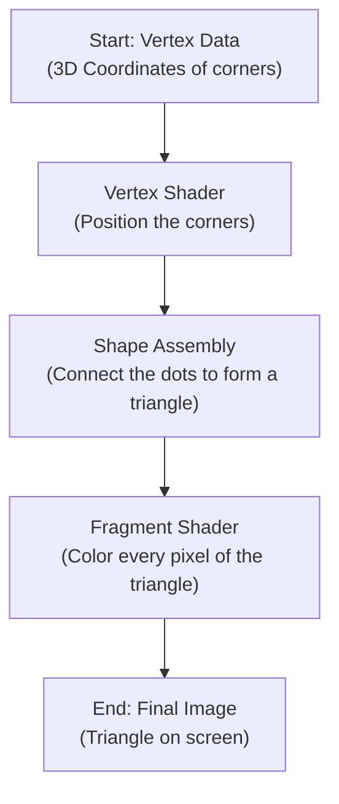

# Lab 01: Hello Triangle

In this lab, you'll learn the fundamental steps to create a window and render your very first shape: a triangle. Think of yourself as an artist. Before you can paint your masterpiece, you need to set up your canvas and prepare your paints. In OpenGL, it's a very similar process.

### Part 1: Creating Your Digital Canvas (The Window)

Before we can draw anything, we need a window to draw in. We'll use a library called **GLFW** to handle the window creation for us. GLFW is like a helpful assistant that manages the operating system-specific tasks of opening windows and handling user input (like mouse clicks or key presses).

The process can be broken down into three simple steps:

1.  **Initialization**: We tell GLFW to get ready.
2.  **Creation**: We ask GLFW to create the actual window with a specific size and title. We also tell OpenGL that this new window is the one we'll be drawing on.
3.  **The Render Loop**: We create a loop that keeps the window open until the user decides to close it. This loop is the heartbeat of our program.


Here's the code that accomplishes this:

```cpp
#include <GLFW/glfw3.h>

int main() {
    // 1. Initialize GLFW
    glfwInit();

    // 2. Create a window and make it our main "context"
    GLFWwindow* window = glfwCreateWindow(800, 600, "Hello OpenGL", NULL, NULL);
    glfwMakeContextCurrent(window);

    // 3. The Render Loop (keeps the window alive)
    while (!glfwWindowShouldClose(window)) {
        // Swaps the front and back buffers
        glfwSwapBuffers(window);

        // Checks for user events, like closing the window
        glfwPollEvents();
    }

    // Cleanup before the program ends
    glfwTerminate();
}
```

#### What's happening in the Render Loop?

- `glfwSwapBuffers(window)`: Imagine you have two canvases. One is currently on display (the **front buffer**), and the other is hidden, where you are busy drawing the next frame (the **back buffer**). Once you're done drawing, you swap them, so the newly finished drawing is now visible. This technique is called **double buffering**, and it prevents the user from seeing a flickering, half-drawn image.

  _An illustration of Double Buffering. While one image is on the screen, the next one is being prepared in the background._

- `glfwPollEvents()`: This is you checking if the user has done anything, like clicking the 'X' button to close the window.

At this point, you have a blank window. Now, let's get ready to paint!

### Part 2: Drawing Your Image (The Triangle)


To draw a triangle, we need to tell the Graphics Processing Unit (GPU) exactly what to draw and how to draw it. We can think of the GPU as a highly efficient factory for creating images. Our job is to send it the raw materials (data) and the instructions (programs).

This process follows what's known as the **Graphics Pipeline**.



#### Step 2.1: Defining the Raw Materials (Vertices)

First, we need to define the corners of our triangle. In computer graphics, a corner or a point in space is called a **vertex**. We'll define three vertices to make a triangle. We define them in a special coordinate system where `(0, 0)` is the center of the screen.

```cpp
// The three corners of our triangle (x, y, z)
float vertices[] = {
    -0.5f, -0.5f, 0.0f, // Bottom-left corner
     0.5f, -0.5f, 0.0f, // Bottom-right corner
     0.0f,  0.5f, 0.0f  // Top-center corner
};
```

#### Step 2.2: Sending the Data to the GPU Factory

We can't just send this array of numbers to the GPU directly. We need to load it into the GPU's memory. For this, we use special objects:

- **VBO (Vertex Buffer Object)**: Think of this as a box. We put our `vertices` data into this box to send it to the GPU.
- **VAO (Vertex Array Object)**: Think of this as a blueprint. It tells the GPU how to interpret the data inside the VBO box. It says, "The data for one vertex consists of 3 floating-point numbers." This way, the GPU knows how to read the coordinates for each corner.

```cpp
// Generate a VAO and VBO
unsigned int VAO, VBO;
glGenVertexArrays(1, &VAO);
glGenBuffers(1, &VBO);

// Set up the blueprint (VAO) and the data box (VBO)
glBindVertexArray(VAO);
glBindBuffer(GL_ARRAY_BUFFER, VBO);
glBufferData(GL_ARRAY_BUFFER, sizeof(vertices), vertices, GL_STATIC_DRAW);

// Tell the VAO blueprint how to read the data
glVertexAttribPointer(0, 3, GL_FLOAT, GL_FALSE, 3 * sizeof(float), (void*)0);
glEnableVertexAttribArray(0);
```

#### Step 2.3: Hiring the Artists (Shaders)

We can skip this part for now. (Shader is a small program that run on the GPU.)

Now that the GPU has our vertex data, we need to give it instructions on what to do. These instructions are small programs called **shaders** that run directly on the GPU. For a simple triangle, we need two types of shaders.

1.  **The Vertex Shader (The Positioning Artist)**: Its job is to take a single vertex (one of our corners) and calculate its final position on the screen.

    ```cpp
    // Vertex Shader Code
    const char* vertexShaderSrc = R"(
    #version 330 core
    layout(location = 0) in vec3 aPos; // Input: a corner's position
    void main() {
        // Output: the final screen position of that corner
        gl_Position = vec4(aPos, 1.0);
    }
    )";
    ```

2.  **The Fragment Shader (The Coloring Artist)**: After the Vertex Shader has positioned the triangle's corners, the GPU figures out all the pixels that are inside the triangle. The Fragment Shader's job is to run for **every single one of those pixels** and decide its final color. Here, we're making every pixel a nice orange color.

    ```cpp
    // Fragment Shader Code
    const char* fragmentShaderSrc = R"(
    #version 330 core
    out vec4 FragColor; // Output: the color for a pixel
    void main() {
        // Set the color to Orange (Red, Green, Blue, Alpha)
        FragColor = vec4(1.0, 0.5, 0.2, 1.0);
    }
    )";
    ```

#### Step 2.4: Assembling the Final Program

We've written our shader programs, but they're just text for now. We need to compile them and link them together into a single **Shader Program**. This is like hiring our two artists and making sure they can work together as a team.

```cpp
// Compile Vertex Shader
unsigned int vertexShader = glCreateShader(GL_VERTEX_SHADER);
glShaderSource(vertexShader, 1, &vertexShaderSrc, NULL);
glCompileShader(vertexShader);

// Compile Fragment Shader
unsigned int fragmentShader = glCreateShader(GL_FRAGMENT_SHADER);
glShaderSource(fragmentShader, 1, &fragmentShaderSrc, NULL);
glCompileShader(fragmentShader);

// Link them into a single Shader Program
unsigned int shaderProgram = glCreateProgram();
glAttachShader(shaderProgram, vertexShader);
glAttachShader(shaderProgram, fragmentShader);
glLinkProgram(shaderProgram);

// We can delete the individual shaders now, as they're in the program
glDeleteShader(vertexShader);
glDeleteShader(fragmentShader);
```

#### Step 2.5: The Final Render!

Now we have everything we need! We just need to add the drawing commands to our render loop from Part 1.

```cpp
// The updated Render Loop
while (!glfwWindowShouldClose(window)) {
    // 1. Clear the canvas with a background color (e.g., black)
    glClear(GL_COLOR_BUFFER_BIT);

    // 2. Activate our shader team
    glUseProgram(shaderProgram);

    // 3. Use our vertex data's blueprint
    glBindVertexArray(VAO);

    // 4. Draw the triangle!
    glDrawArrays(GL_TRIANGLES, 0, 3);

    // Swap buffers and check for events
    glfwSwapBuffers(window);
    glfwPollEvents();
}
```

And that's it! When you run the full program, you will see a beautiful orange triangle on a black background.

Congratulations, you have successfully completed the "Hello Triangle" lab and taken your first major step into the world of real-time graphics programming!

---

# References

- [Hello Triangle - Learn OpenGL](https://learnopengl.com/Getting-started/Hello-Triangle)
