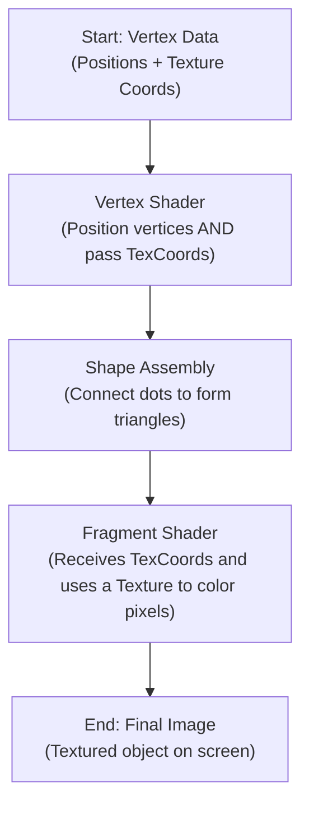

# Lab 02: Texture and Shader

In the last session, you created your first shape. Now, it's time to give it some life and detail. We'll be exploring how to wrap 2D images, called **textures**, onto our 3D objects.

Let's return to our analogy of the GPU as a high-tech factory. You've already built the raw chassis of a car (the triangle). Now, you're going to hire a specialized painter robot (the **Fragment Shader**) and give it a detailed decal sheet (a **Texture**) to apply to the car's body, making it look realistic and interesting.

### Part 1: Expanding the Blueprint (Adding Texture Coordinates)

To apply a decal to a car, the factory robot needs a blueprint that shows exactly where each part of the decal goes. Similarly, to apply a texture to a triangle, we need to tell the GPU which part of the 2D image maps to each corner (vertex) of our triangle.

These mapping instructions are called **Texture Coordinates**. They are 2D coordinates that range from `(0, 0)` (bottom-left corner of the image) to `(1, 1)` (top-right corner).

*How texture coordinates map a 2D image onto a 3D object (a quad in this case).*

#### Step 1.1: Updating the Raw Materials (Vertices)

We now need to add this new texture coordinate data to our `vertices` array. Each vertex will now have a 3D position and a 2D texture coordinate. We'll draw a rectangle (made of two triangles) this time to make the texture more visible.

```cpp
// Each vertex now has: position (x, y, z) and texture coordinate (s, t)
float vertices[] = {
    // positions          // texture coords
     0.5f,  0.5f, 0.0f,   1.0f, 1.0f,   // top right
     0.5f, -0.5f, 0.0f,   1.0f, 0.0f,   // bottom right
    -0.5f, -0.5f, 0.0f,   0.0f, 0.0f,   // bottom left
    -0.5f,  0.5f, 0.0f,   0.0f, 1.0f    // top left
};

// We also define an Element Buffer Object (EBO) to reuse vertices
unsigned int indices[] = {
    0, 1, 3, // first triangle
    1, 2, 3  // second triangle
};
```

#### Step 1.2: Updating the GPU's Blueprint (The VAO)

Since we've added new data, we must update our VAO "blueprint" to tell the GPU how to read it. Before, it just read positions. Now, it needs to know how to find both the position and the texture coordinate within the data stream.

```cpp
// 1. Position attribute (location = 0)
glVertexAttribPointer(0, 3, GL_FLOAT, GL_FALSE, 5 * sizeof(float), (void*)0);
glEnableVertexAttribArray(0);

// 2. Texture coordinate attribute (location = 1)
glVertexAttribPointer(1, 2, GL_FLOAT, GL_FALSE, 5 * sizeof(float), (void*)(3 * sizeof(float)));
glEnableVertexAttribArray(1);
```
*   The first line is for the position, just like before, but notice the "stride" is now `5 * sizeof(float)` because each vertex takes up 5 float values.
*   The second line is new. It tells the GPU that our second attribute (`location = 1`) is the texture coordinate. It's 2 floats long, and it starts after the 3 position floats.

### Part 2: Upgrading the Artists (The Shaders)

<iframe width="560" height="315" src="https://www.youtube.com/embed/brDJVEPOeY8?si=J0dDgq_xhePZPeL9" title="YouTube video player" frameborder="0" allow="accelerometer; autoplay; clipboard-write; encrypted-media; gyroscope; picture-in-picture; web-share" referrerpolicy="strict-origin-when-cross-origin" allowfullscreen></iframe>

Our old shaders only knew how to position vertices and draw a solid color. We need to give them an upgrade to handle textures.



#### The Vertex Shader (Passing the Blueprint)

The Vertex Shader's new job is to receive the texture coordinate from the VAO and simply pass it along to the next stage in the pipeline.

```glsl
// Vertex Shader Code (shader.vs)
#version 330 core
layout (location = 0) in vec3 aPos;         // Input: vertex position
layout (location = 1) in vec2 aTexCoord;    // Input: texture coordinate

out vec2 TexCoord; // Output the texture coordinate to the fragment shader

void main() {
    gl_Position = vec4(aPos, 1.0);
    TexCoord = aTexCoord; // Pass the coordinate along
}
```

#### The Fragment Shader (The Master Painter)

This is where the real magic happens. The Fragment Shader receives the texture coordinate for each pixel. It also gets a new special variable, a `sampler2D`, which holds the actual texture image. Its job is to use the coordinate to look up the correct color from the texture and apply it to the pixel.

```glsl
// Fragment Shader Code (shader.fs)
#version 330 core
out vec4 FragColor; // Output: the final color for a pixel

in vec2 TexCoord; // Input: the coordinate from the Vertex Shader

uniform sampler2D ourTexture; // The actual texture image from our C++ code

void main() {
    // Look up the color from the texture at the given coordinate
    FragColor = texture(ourTexture, TexCoord);
}
```

### Part 3: Preparing the Decal Sheet (Loading the Texture Image)

We've told our shaders *how* to use a texture, but we haven't actually given them one yet. We need to load an image file (like a `.png` or `.jpg`) from our disk into the GPU's memory. For this, we'll use a popular, easy-to-use library called **`stb_image.h`**.

1.  **Generate a Texture Object**: We ask OpenGL to create an empty texture object for us.
2.  **Load the Image Data**: We use `stb_image` to load the pixel data from the file.
3.  **Send Data to GPU**: We bind our texture object and send the pixel data we just loaded to the GPU.

Here's the C++ code to load a texture named `container.jpg`:

```cpp
#include <stb_image.h> // A library to load images

// 1. Generate and bind the texture object
unsigned int texture;
glGenTextures(1, &texture);
glBindTexture(GL_TEXTURE_2D, texture);

// Optional: Set texture wrapping and filtering options
glTexParameteri(GL_TEXTURE_2D, GL_TEXTURE_WRAP_S, GL_REPEAT);
glTexParameteri(GL_TEXTURE_2D, GL_TEXTURE_WRAP_T, GL_REPEAT);
glTexParameteri(GL_TEXTURE_2D, GL_TEXTURE_MIN_FILTER, GL_LINEAR);
glTexParameteri(GL_TEXTURE_2D, GL_TEXTURE_MAG_FILTER, GL_LINEAR);

// 2. Load the image data from a file
int width, height, nrChannels;
unsigned char *data = stbi_load("container.jpg", &width, &height, &nrChannels, 0);

// 3. Send the image data to the GPU
if (data) {
    glTexImage2D(GL_TEXTURE_2D, 0, GL_RGB, width, height, 0, GL_RGB, GL_UNSIGNED_BYTE, data);
    glGenerateMipmap(GL_TEXTURE_2D);
} else {
    std::cout << "Failed to load texture" << std::endl;
}

// Free the CPU memory, as the data is now on the GPU
stbi_image_free(data);
```

### Part 4: The Final Render!

We're all set! All that's left is to tell OpenGL to use our texture when drawing. We do this inside the main render loop.

```cpp
// The updated Render Loop
while (!glfwWindowShouldClose(window)) {
    // 1. Clear the canvas
    glClear(GL_COLOR_BUFFER_BIT);

    // 2. Activate our shader program
    glUseProgram(shaderProgram);

    // 3. IMPORTANT: Bind the texture so the shader can use it
    glBindTexture(GL_TEXTURE_2D, texture);

    // 4. Use our vertex data's blueprint
    glBindVertexArray(VAO);

    // 5. Draw the textured rectangle!
    // We use glDrawElements because we have an EBO
    glDrawElements(GL_TRIANGLES, 6, GL_UNSIGNED_INT, 0);

    // Swap buffers and check for events
    glfwSwapBuffers(window);
    glfwPollEvents();
}
```

And there you have it! When you run the complete program, you will see your image beautifully wrapped around a rectangle. You've just mastered one of the most fundamental and powerful concepts in computer graphics.

---

# References

- [Textures - Learn OpenGL](https://learnopengl.com/Getting-started/Textures)
