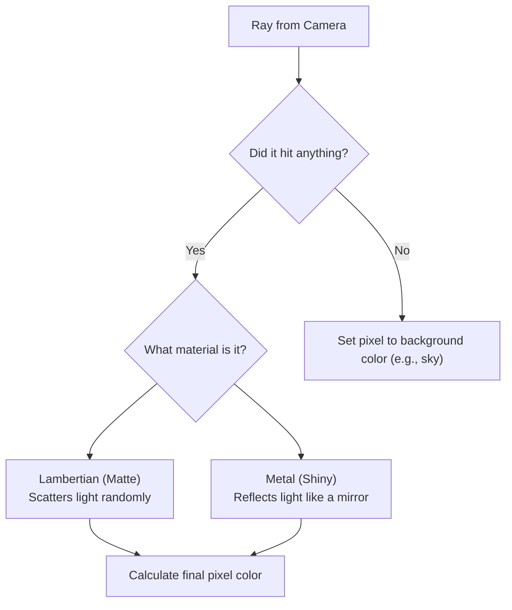

# Lab 05: Ray Tracing - Becoming a Virtual Photographer

In previous labs, you've learned how to instruct the GPU to draw shapes and apply textures using a process called rasterization. Now, we're going to take a completely different approach to creating images: **Ray Tracing**.

Imagine you are a photographer in a virtual world. To take a picture, you don't just throw objects at the screen. Instead, you decide where each pixel's color comes from by tracing the path of a light ray _backwards_ from your camera, through the pixel, and out into the scene. What that ray hits determines the color. This is the essence of ray tracing, a technique famous for creating stunningly realistic images.

In this lab, you'll build the core of a ray tracer from scratch. You'll be the photographer, the lighting designer, and the architect of your own 3D world.


[Repository Link](https://github.com/2110479-Computer-Graphics/Lab05-Raytracing)

### Prerequisites: The Tools of a Virtual Photographer

Before we build our camera, we need to understand our "film" and the fundamental theory behind our new photography method.

#### The PPM File: Your Digital Film

In past labs, we let OpenGL and the GPU handle the complex task of displaying our image on the screen. For this ray tracer, we are going to generate the image file ourselves, pixel by pixel. To keep things simple, we'll use the **PPM (Portable Pixmap) file format**.

Why PPM? It's a beautifully simple, text-based image format. You can literally open a `.ppm` file in a text editor and see the pixels! A PPM file looks like this:

<div style="align-items: center; display: flex; flex-direction: column; gap: 1rem;">


</div>

```
P3
# P3 means this is an ASCII PPM file
# The next line is the width and height of the image
3 2
# The next line is the maximum color value
255
# Below are the pixel RGB triplets (Red, Green, Blue)
255   0   0     # Red pixel
0   255   0     # Green pixel
0   0   255     # Blue pixel
255 255   0     # Yellow pixel
255 255 255     # White pixel
0   0   0       # Black pixel
```

Our C++ program will calculate the RGB color for every single pixel in our scene and write it to a `.ppm` file in this exact format. You can then open this file with most image viewers (like GIMP, IrfanView, or specialized online viewers).

#### The Core Idea: From Pixels to Light Rays

The most important concept to grasp is the shift from **rasterization** to **ray tracing**.

- **Rasterization (What you've done before)**: You take 3D objects (triangles) and project them onto a 2D screen to figure out which pixels they cover. It's an "object-first" approach, processed incredibly fast by the GPU.
- **Ray Tracing (What you'll do now)**: You start with a 2D pixel on the screen and cast a ray from the camera out into the 3D world to see what it hits. It's a "pixel-first" approach, which we will implement on the CPU. This method excels at simulating how light really works, making reflections, shadows, and refractions much easier to achieve realistically.

### Part 1: Setting Up the Camera (Your Virtual Eye)

A photographer can't take a picture without a camera. Our virtual camera's job is to shoot out rays of light into the scene. Each pixel in our final image corresponds to one initial ray.

#### Step 1.1: Understanding the Viewport

Think of the final image as a screen or "viewport" positioned in front of your camera. To figure out the color of a specific pixel, we cast a **ray** from the camera's origin, through that pixel's position on the viewport, and into the world.

- **Examine `camera.cpp`**: Look at the `get_ray()` method. This function is the heart of your camera. It takes the coordinates of a pixel (`u`, `v`) and calculates the direction of the ray that should pass through it.
- **Experiment**: Try modifying the camera's position, the point it's looking at, or its field-of-view (aperture). Observe how changing your "lens" or "position" alters the final rendered image.

### Part 2: What Did the Ray Hit? (Ray-Sphere Intersection)

You've cast a ray out into the world. Now what? The ray travels in a straight line until it hits an object. Your next task is to detect that collision, or **intersection**.

We'll start with the simplest 3D shape: a sphere. To find if a line (our ray) and a sphere intersect, we can use a bit of algebra. The ray can be described by the equation $P(t) = A + t\vec{b}$, where A is the ray's origin and $\vec{b}$ is its direction. The sphere is defined by all points a certain radius, _r_, from its center, _C_.

By solving for _t_, we can find the exact point of intersection.

- **Analyze `sphere.cpp`**: This file contains the code that solves this exact problem. You'll see a function that implements the quadratic equation to find if, and where, the ray hits the sphere.
- **Play with it**: Create spheres of different sizes and at different locations in your `main.cpp` file to see your intersection logic at work.

### Part 3: What Does It Look Like? (Implementing Materials)

Once a ray hits an object, we need to know its color. This is determined by the object's **material**. How does it interact with light? Does it absorb it, scatter it, or reflect it like a mirror?



#### Step 3.1: The Matte Painter (Lambertian Material)

A **Lambertian**, or diffuse, material represents a perfect matte surface, like a piece of colored chalk or a painted wall. When light hits it, it scatters in all random directions. The result is a surface with a uniform, flat appearance.

- **Study `materials/lambertian.cpp`**: Understand how it uses the object's surface normal (the direction the surface is facing) to calculate this scattered ray.

#### Step 3.2: The Polished Chrome (Metal Material)

A **Metal** material is specular, or reflective. It acts like a mirror. A ray that hits it bounces off in a predictable direction, just like a ball bouncing off a wall. We can also add a "roughness" parameter, which introduces a bit of random fuzziness to the reflections, simulating a brushed or sand-blasted metal surface.

- **Examine `materials/metal.cpp`**: See how it calculates the perfect reflection vector and how the `roughness` parameter perturbs that vector to create blurry reflections.

### Part 4: Building Your World (Scene Composition)

Now you have all the pieces: a camera, objects (spheres), and materials (Lambertian and Metal). It's time to be an architect and compose a scene!

- **Work in `main.cpp`**: This is your playground.
  1.  Create a "world" that can hold a list of objects.
  2.  Instantiate several spheres.
  3.  Assign different materials to them. Try a mix of matte and metallic objects.
  4.  Position them in an interesting way. Maybe one sphere is large and acts as the "ground."

### Part 5: The Final Image (Rendering Pipeline & Polish)

This is where everything comes together. The complete process, from your camera to the final pixel color, is the **rendering pipeline**. For each pixel in your image:

1.  **Generate a Ray**: Create the initial ray from the camera.
2.  **Test for Intersection**: Loop through all objects in the scene and find the closest one the ray hits.
3.  **Calculate Color**: If you hit an object, ask its material how the light scatters or reflects. This might create new rays that bounce around the scene!
4.  **Set Pixel Color**: The color returned from the material is the final color for that pixel.

#### Advanced Feature: Anti-Aliasing

If you cast only one ray per pixel, you might notice sharp, jagged edges ("jaggies"). To fix this, we can use **anti-aliasing**. Instead of sending one ray through the center of a pixel, we send multiple, slightly offset rays and average the resulting colors. This produces a much smoother and more realistic final image.

### Part 6: Your Creative Project (Deliverables)

Now it's your turn to be the artist and engineer.

### Example


#### Task A: The Basic Scene

- Fill all `TODO` sections in provided files.
- Render an image with at least three spheres.
- Use both `Lambertian` and `Metal` materials to show you understand both.
- Include a large sphere to act as a ground plane.

#### Task B: Material & Shape Exploration

- **Create Your Own Material**: Go beyond Metal and Lambertian. Implement a new material. Some ideas:
  - **Glass/Dielectric (`refract`)**: A transparent material that bends light.
  - **Emissive (`light`)**: A material that glows and gives off its own light.
- **Create Your Own Shape**: Don't just use spheres. Implement the intersection logic for a new geometric primitive. Some ideas:
  - An infinite **Plane**.
  - An **Axis-Aligned Bounding Box (AABB)**.

Good luck, and have fun creating your first photorealistic images!

### Deliverables

- Repository link with your completed code (if any).
- What did you do for materials and shapes?
- How do I make an image with a 16:9 aspect ratio, a width of 1920 pixels, and 100 samples per pixel render faster? Please also provide an analysis of the approaches you suggest.
---

### Resources

- [Ray Tracing in One Weekend by Peter Shirley](https://raytracing.github.io/books/RayTracingInOneWeekend.html)
- _Real-Time Rendering_ (Akenine-Möller et al.)
- _Computer Graphics: Principles and Practice_
